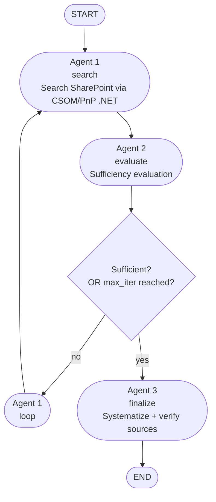

# LangGraph SharePoint Audit Agent

Multi-agent document audit workflow built with LangGraph, targeting deployment
as an Azure Container App and later as an Azure AI Foundry Hosted Agent.

## Architecture

Three-agent Corrective-RAG pattern with a bounded retry loop:



## Key design decisions

- **State schema**: `app/schemas/state.py` — `AuditState` TypedDict + Pydantic
  `SufficiencyVerdict` for Agent 2's structured output (no free-text parsing).
- **Loop guard**: `iteration` counter + `MAX_ITERATIONS`, escalates to Agent 3
  with a `partial_evidence` flag instead of looping forever.
- **Audit trail**: every Agent 2 verdict is appended to `verdict_history` in
  state — required for EU AI Act Annex III traceability.
- **SharePoint access**: Agent 1 does NOT call SharePoint directly from Python.
  CSOM via PnP Framework is .NET-only, so the actual extraction happens in a
  small .NET sidecar/service (`sharepoint-csom-service/`, not yet scaffolded)
  that Agent 1 calls over HTTP. See `app/tools/sharepoint_tool.py` for the
  Python-side interface stub and the integration note at the top of that file.
- **Hosting adapter**: `app/main.py` wraps the compiled graph with
  `langchain_azure_ai.agents.hosting` so the same container image runs
  unmodified on Azure Container Apps today and as a Foundry Hosted Agent later.
- **Checkpointer**: defaults to in-memory `MemorySaver` for local dev; swap
  for `AsyncPostgresSaver` (or equivalent) before any real deployment — see
  `app/graph.py`.

## Project layout

```
langgraph-sharepoint-demo/
├── app/
│   ├── main.py                  # FastAPI / hosting adapter entrypoint
│   ├── graph.py                 # StateGraph assembly, routing, checkpointer
│   ├── schemas/
│   │   └── state.py             # AuditState, SufficiencyVerdict, enums
│   ├── nodes/
│   │   ├── agent1_search.py
│   │   ├── agent2_evaluate.py
│   │   └── agent3_finalize.py
│   └── tools/
│       └── sharepoint_tool.py   # Stub — calls out to .NET CSOM/PnP service
├── tests/
│   ├── test_graph_routing.py
│   └── test_state_schema.py
├── docker/
│   └── Dockerfile
├── .github/workflows/
│   └── build-and-push.yml       # ACR build placeholder
├── .env.example
├── pyproject.toml
└── README.md
```

## Local development

```bash
pip install -e ".[dev]"
cp .env.example .env  # fill in Azure OpenAI + SharePoint service endpoint
uvicorn app.main:app --reload --port 8000
```

Test locally via the Responses protocol:

```bash
curl -X POST http://localhost:8000/responses \
  -H "Content-Type: application/json" \
  -d '{"input": {"messages": [{"role": "user", "content": "Audit retention policy docs for case #4471"}]}}'
```

## Deployment path

1. **Azure Container Instances + Application Gateway** (current stage) — all
   infrastructure is provisioned via Terraform (`terraform/`, see
   `terraform/README.md`). The container image is built and pushed to ACR by
   `.github/workflows/build-and-push.yml`; Terraform then deploys it into an
   ACI container group fronted by an Application Gateway (TLS termination,
   public ingress), with a private-VNet Postgres-backed checkpointer (no
   public endpoint) and secrets in Key Vault. A jumpbox VM in the same VNet
   is the only way to reach Postgres directly (see below).
2. **Azure AI Foundry Hosted Agent** (future migration, currently preview) —
   same image, redeploy via `az cognitiveservices agent` / `azd ai agent
   init`, swap `AZURE_OPENAI_ENDPOINT` env var for the Foundry-injected
   `FOUNDRY_PROJECT_ENDPOINT`, and move SharePoint access behind the Foundry
   Toolbox MCP endpoint instead of a direct service call.

## Connecting to Postgres (jumpbox tunnel)

Postgres has no public endpoint — it's only reachable from inside the VNet
(the ACI container, or the jumpbox VM). To run `psql`, a migration, or any
other admin task from your local machine, open an SSH tunnel through the
jumpbox first:

```bash
# Get the jumpbox public IP and Postgres FQDN from Terraform outputs:
cd terraform/environments/dev
terraform output -raw jumpbox_public_ip
terraform output -raw postgres_fqdn

# Open a local port-forward through the jumpbox (leave this running):
ssh -L 5432:<postgres_fqdn>:5432 azureuser@<jumpbox_public_ip>

# In another terminal, connect through the tunnel:
psql "host=localhost port=5432 dbname=langgraph_checkpoints user=auditagent sslmode=require"
```

The jumpbox only accepts SSH (port 22) from the IP set in `local_ip` — see
`terraform/README.md`. No other inbound path to Postgres exists.

## Open items / TODO

- [ ] Scaffold the .NET CSOM/PnP Framework sidecar service that Agent 1 calls.
- [ ] Wire `AsyncPostgresSaver` (or Cosmos DB checkpointer) for durable state.
- [ ] Add `requires_human_review` as an explicit graph branch (interrupt) once
      the human-in-the-loop reviewer flow is defined.
- [ ] Wrap SharePoint tool as an MCP server for the future Foundry Toolbox
      migration.
