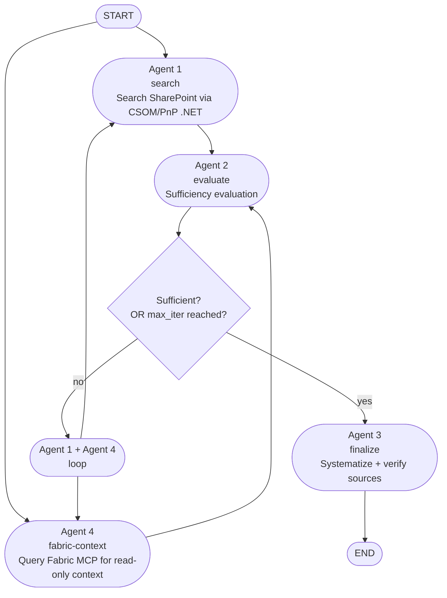

# Fabric MCP Context Agent Implementation Plan

> **For agentic workers:** REQUIRED SUB-SKILL: Use superpowers:subagent-driven-development (recommended) or superpowers:executing-plans to implement this plan task-by-task. Steps use checkbox (`- [ ]`) syntax for tracking.

**Goal:** Add a fourth graph node that queries Microsoft Fabric's remote MCP server for additional read-only context, running in parallel with Agent 1 on every iteration of the existing retry loop.

**Architecture:** Unlike Agent 1/2/3 (fixed deterministic function calls), Agent 4 is a real LLM tool-calling step: `langchain-mcp-adapters`' `MultiServerMCPClient` loads Fabric's MCP tools, filtered to a read-only allowlist, bound to the LLM for one bounded round of tool-calling. Auth is Managed Identity bridged into the MCP HTTP client via a custom `httpx.Auth` subclass (the real, verified mechanism — `langchain-mcp-adapters` 0.3.0's `StreamableHttpConnection` TypedDict has an `auth: httpx.Auth` field for exactly this). The graph fans out from `START` (and from the retry loop-back) into `agent1` + `agent4` in parallel, both feeding into `agent2` — LangGraph's native multi-target conditional-edge return (`path` may return `str | list[str]`) and its superstep-based fan-in handle this without extra plumbing.

**Tech Stack:** `langchain-mcp-adapters` 0.3.0, `httpx.Auth`, `azure-identity` (already a dependency, `aio.ManagedIdentityCredential`), LangGraph 1.2.7 (installed version — conditional edges confirmed to support list-of-node-names returns for fan-out), pytest.

## Global Constraints

- Read-only Fabric tool allowlist only: `search_catalog`, `list_workspaces`, `get_workspace`, `list_items`, `get_item`, `get_item_definition`, `list_folders`, `get_folder`, `list_capacities`, `get_knowledge`. No mutating tool (create/update/delete/role operations) may ever be bound to the LLM.
- Bounded tool-calling: one LLM call with tools bound → execute any requested tool calls → one follow-up LLM call to synthesize a summary. Not an open-ended ReAct loop.
- Agent 4 runs in parallel with Agent 1 on every retry-loop iteration (not just once), using `state["query"]` — no separate Fabric-specific query input.
- Auth: Managed Identity only, via a custom `httpx.Auth` subclass — no interactive/device-code flow, no static bearer header (tokens expire ~1h and must be refreshed per-request, which `ManagedIdentityCredential.get_token()`'s internal caching/refresh already handles correctly when called on every request).
- No live network call to `https://api.fabric.microsoft.com` in any automated test.
- No Terraform/infrastructure changes — app-code only. The Managed Identity's Fabric API permission grant is a manual, human-run prerequisite, documented but not automated.

---

### Task 1: Add `langchain-mcp-adapters` dependency

**Files:**
- Modify: `pyproject.toml`

**Interfaces:**
- Produces: `langchain_mcp_adapters.client.MultiServerMCPClient` becomes importable — consumed by Task 3.

- [ ] **Step 1: Add the dependency**

In `pyproject.toml`, add to the `azure` extra (alongside `langchain-azure-ai`, `azure-identity`, etc. — this is a production/cloud-integration dependency, same category):

```toml
azure = [
    "langchain-azure-ai[hosting]>=1.2.4",
    "azure-identity>=1.17",
    "langgraph-checkpoint-postgres>=2.0.0",
    "psycopg[binary,pool]>=3.2",
    "langchain-mcp-adapters>=0.3.0",
]
```

(only the last line is new — the others already exist, shown for context so you find the right list).

- [ ] **Step 2: Install and verify**

Run: `pip install -e ".[azure,dev]"`
Then: `python -c "from langchain_mcp_adapters.client import MultiServerMCPClient; from langchain_mcp_adapters.sessions import StreamableHttpConnection; print('ok')"`
Expected: prints `ok` with no `ModuleNotFoundError`.

- [ ] **Step 3: Commit**

```bash
git add pyproject.toml
git commit -m "feat: add langchain-mcp-adapters dependency for Fabric MCP integration"
```

---

### Task 2: `app/tools/fabric_auth.py` — Managed Identity bridge for the MCP HTTP client

**Files:**
- Create: `app/tools/fabric_auth.py`
- Test: `tests/test_fabric_auth.py`

**Interfaces:**
- Consumes: `azure.identity.aio.ManagedIdentityCredential` (already available via the existing `azure-identity` dependency).
- Produces: `FabricManagedIdentityAuth` (an `httpx.Auth` subclass) and `FABRIC_SCOPE` (str constant) — consumed by Task 3's MCP client construction.

This is the one piece of this plan that needed real-package verification before being written as confirmed (not guessed) code: `langchain-mcp-adapters` 0.3.0's `StreamableHttpConnection` TypedDict (in `langchain_mcp_adapters.sessions`) has an `auth: NotRequired[httpx.Auth]` field — httpx's own extensible auth interface, verified by reading the installed package's source during planning. `azure.identity.aio.ManagedIdentityCredential.get_token(*scopes)` internally caches and refreshes tokens, so calling it inside `async_auth_flow` on every request is the correct, standard pattern — not wasteful, and never lets a token silently expire mid-session.

- [ ] **Step 1: Write the failing test**

`tests/test_fabric_auth.py`:
```python
from unittest.mock import AsyncMock

import httpx
import pytest
from azure.core.credentials import AccessToken

from app.tools.fabric_auth import FABRIC_SCOPE, FabricManagedIdentityAuth


@pytest.mark.asyncio
async def test_async_auth_flow_sets_bearer_header_from_managed_identity_token():
    mock_credential = AsyncMock()
    mock_credential.get_token.return_value = AccessToken("fake-token-value", 9999999999)

    auth = FabricManagedIdentityAuth(credential=mock_credential)
    request = httpx.Request("POST", "https://api.fabric.microsoft.com/v1/mcp/core")

    flow = auth.async_auth_flow(request)
    yielded_request = await flow.__anext__()

    assert yielded_request.headers["Authorization"] == "Bearer fake-token-value"
    mock_credential.get_token.assert_awaited_once_with(FABRIC_SCOPE)


@pytest.mark.asyncio
async def test_default_credential_is_managed_identity_credential():
    from azure.identity.aio import ManagedIdentityCredential

    auth = FabricManagedIdentityAuth()
    assert isinstance(auth._credential, ManagedIdentityCredential)
```

- [ ] **Step 2: Run tests to verify they fail**

Run: `pytest tests/test_fabric_auth.py -v`
Expected: FAIL with `ModuleNotFoundError: No module named 'app.tools.fabric_auth'`

- [ ] **Step 3: Write the implementation**

`app/tools/fabric_auth.py`:
```python
"""httpx.Auth bridging Managed Identity into the Fabric MCP client.

langchain-mcp-adapters' StreamableHttpConnection accepts an `auth: httpx.Auth`
field (confirmed via inspection of the installed langchain-mcp-adapters 0.3.0
package's `sessions.StreamableHttpConnection`) — httpx's own extensible auth
interface, the correct mechanism for a token that must be refreshed per
request rather than supplied once as a static header.
`ManagedIdentityCredential.get_token()` caches and refreshes internally, so
calling it in `async_auth_flow` on every request is correct and cheap.
"""

from __future__ import annotations

import httpx
from azure.identity.aio import ManagedIdentityCredential

FABRIC_SCOPE = "https://api.fabric.microsoft.com/.default"


class FabricManagedIdentityAuth(httpx.Auth):
    """Acquires a Managed Identity token for the Fabric MCP server's scope
    on every request; azure-identity handles caching/refresh internally.
    """

    def __init__(self, credential: ManagedIdentityCredential | None = None) -> None:
        self._credential = credential or ManagedIdentityCredential()

    async def async_auth_flow(self, request: httpx.Request):
        token = await self._credential.get_token(FABRIC_SCOPE)
        request.headers["Authorization"] = f"Bearer {token.token}"
        yield request
```

- [ ] **Step 4: Run tests to verify they pass**

Run: `pytest tests/test_fabric_auth.py -v`
Expected: PASS (2/2)

- [ ] **Step 5: Commit**

```bash
git add app/tools/fabric_auth.py tests/test_fabric_auth.py
git commit -m "feat: add FabricManagedIdentityAuth (httpx.Auth bridge for Managed Identity)"
```

---

### Task 3: `app/nodes/agent4_fabric_context.py` — tool filtering + bounded tool-calling node

**Files:**
- Create: `app/nodes/agent4_fabric_context.py`
- Test: `tests/test_agent4_fabric_context.py`

**Interfaces:**
- Consumes: `app.tools.fabric_auth.FabricManagedIdentityAuth` (Task 2), `AuditState` (existing, gains `fabric_context` in Task 4 — this task's tests use plain dicts for state, matching the TypedDict structurally, since Task 4 hasn't added the field to the schema yet — that's fine, `AuditState` is a `TypedDict` and Python doesn't enforce it at runtime).
- Produces: `filter_read_only_tools(tools: list) -> list`, `agent4_fabric_context(state: AuditState, llm: BaseChatModel) -> dict` (returns `{"fabric_context": [...]}`) — consumed by Task 4's graph wiring, which calls this via `partial(agent4_fabric_context, llm=llm)`, exactly matching how `agent2`/`agent3` are already wired in `app/graph.py`.

- [ ] **Step 1: Write the failing tests**

`tests/test_agent4_fabric_context.py`:
```python
from types import SimpleNamespace
from unittest.mock import AsyncMock, patch

import pytest

from app.nodes.agent4_fabric_context import (
    READ_ONLY_TOOL_NAMES,
    agent4_fabric_context,
    filter_read_only_tools,
)


def _fake_tool(name: str):
    return SimpleNamespace(name=name, ainvoke=AsyncMock(return_value=f"result-for-{name}"))


def test_filter_read_only_tools_keeps_only_allowlisted_names():
    tools = [
        _fake_tool("search_catalog"),
        _fake_tool("create_workspace"),
        _fake_tool("get_item"),
        _fake_tool("delete_item"),
    ]

    filtered = filter_read_only_tools(tools)

    assert {t.name for t in filtered} == {"search_catalog", "get_item"}


def test_read_only_tool_names_has_no_mutating_operations():
    mutating_keywords = ("create", "update", "delete", "add", "move")
    for name in READ_ONLY_TOOL_NAMES:
        assert not any(kw in name for kw in mutating_keywords), f"{name} looks mutating"


@pytest.mark.asyncio
async def test_agent4_fabric_context_no_tool_calls_returns_direct_answer():
    fake_tools = [_fake_tool("search_catalog")]

    llm = AsyncMock()
    llm_with_tools = AsyncMock()
    llm.bind_tools.return_value = llm_with_tools
    llm_with_tools.ainvoke.return_value = SimpleNamespace(
        content="Nothing relevant in Fabric.", tool_calls=[]
    )

    with patch(
        "app.nodes.agent4_fabric_context._build_fabric_tools",
        new=AsyncMock(return_value=fake_tools),
    ):
        result = await agent4_fabric_context({"query": "audit case #123"}, llm=llm)

    assert len(result["fabric_context"]) == 1
    assert result["fabric_context"][0]["summary"] == "Nothing relevant in Fabric."
    assert result["fabric_context"][0]["tool_calls"] == []
    llm.ainvoke.assert_not_called()  # no follow-up summary call needed


@pytest.mark.asyncio
async def test_agent4_fabric_context_executes_tool_calls_and_summarizes():
    fake_tools = [_fake_tool("search_catalog")]

    llm = AsyncMock()
    llm_with_tools = AsyncMock()
    llm.bind_tools.return_value = llm_with_tools
    llm_with_tools.ainvoke.return_value = SimpleNamespace(
        content="",
        tool_calls=[{"name": "search_catalog", "args": {"query": "policy"}, "id": "call-1"}],
    )
    llm.ainvoke.return_value = SimpleNamespace(content="Found related policy docs in Fabric.")

    with patch(
        "app.nodes.agent4_fabric_context._build_fabric_tools",
        new=AsyncMock(return_value=fake_tools),
    ):
        result = await agent4_fabric_context({"query": "audit case #123"}, llm=llm)

    fake_tools[0].ainvoke.assert_awaited_once_with({"query": "policy"})
    assert result["fabric_context"][0]["summary"] == "Found related policy docs in Fabric."
    assert result["fabric_context"][0]["tool_calls"] == [
        {"tool": "search_catalog", "args": {"query": "policy"}, "result": "result-for-search_catalog"}
    ]


@pytest.mark.asyncio
async def test_agent4_fabric_context_no_tools_available_returns_empty_context():
    with patch(
        "app.nodes.agent4_fabric_context._build_fabric_tools",
        new=AsyncMock(return_value=[]),
    ):
        result = await agent4_fabric_context({"query": "audit case #123"}, llm=AsyncMock())

    assert result == {"fabric_context": []}
```

- [ ] **Step 2: Run tests to verify they fail**

Run: `pytest tests/test_agent4_fabric_context.py -v`
Expected: FAIL with `ModuleNotFoundError: No module named 'app.nodes.agent4_fabric_context'`

- [ ] **Step 3: Write the implementation**

`app/nodes/agent4_fabric_context.py`:
```python
"""Agent 4: queries Microsoft Fabric's remote MCP server for additional
read-only audit context, running in parallel with Agent 1 on every
retry-loop iteration.

Unlike Agent 1/2/3 (fixed deterministic function calls), this is a real LLM
tool-calling step — langchain-mcp-adapters loads Fabric's MCP tools, filtered
to a read-only allowlist, bound to the LLM for one bounded round of
tool-calling (one call with tools bound -> execute any requested tool calls
-> one follow-up call to synthesize a summary). Not an open-ended ReAct loop.

Read-only restriction is a deliberate compliance/safety boundary: this
project tracks EU AI Act Annex III traceability elsewhere, and an automated
audit step must never be able to mutate a data platform's workspaces or
permissions.
"""

from __future__ import annotations

import os

from langchain_core.language_models import BaseChatModel
from langchain_core.messages import HumanMessage, SystemMessage, ToolMessage
from langchain_mcp_adapters.client import MultiServerMCPClient

from app.schemas.state import AuditState
from app.tools.fabric_auth import FabricManagedIdentityAuth

FABRIC_MCP_URL = os.environ.get(
    "FABRIC_MCP_URL", "https://api.fabric.microsoft.com/v1/mcp/core"
)

READ_ONLY_TOOL_NAMES = frozenset(
    {
        "search_catalog",
        "list_workspaces",
        "get_workspace",
        "list_items",
        "get_item",
        "get_item_definition",
        "list_folders",
        "get_folder",
        "list_capacities",
        "get_knowledge",
    }
)

SYSTEM_PROMPT = """You have read-only access to Microsoft Fabric via MCP tools.
Given an audit task, decide whether any Fabric data (workspaces, items,
catalog entries) is relevant additional context. Call at most a few tools if
helpful; if nothing in Fabric seems relevant, don't call any tools and say so
directly.
"""


def filter_read_only_tools(tools: list) -> list:
    """Keep only the tools on the read-only allowlist."""
    return [t for t in tools if t.name in READ_ONLY_TOOL_NAMES]


async def _build_fabric_tools() -> list:
    client = MultiServerMCPClient(
        {
            "fabric": {
                "url": FABRIC_MCP_URL,
                "transport": "streamable_http",
                "auth": FabricManagedIdentityAuth(),
            }
        }
    )
    all_tools = await client.get_tools()
    return filter_read_only_tools(all_tools)


async def agent4_fabric_context(state: AuditState, llm: BaseChatModel) -> dict:
    tools = await _build_fabric_tools()

    if not tools:
        return {"fabric_context": []}

    tools_by_name = {t.name: t for t in tools}
    llm_with_tools = llm.bind_tools(tools)

    messages = [
        SystemMessage(content=SYSTEM_PROMPT),
        HumanMessage(content=state["query"]),
    ]
    response = await llm_with_tools.ainvoke(messages)

    if not response.tool_calls:
        return {
            "fabric_context": [
                {
                    "query": state["query"],
                    "summary": response.content,
                    "tool_calls": [],
                }
            ]
        }

    messages.append(response)
    tool_call_results = []
    for call in response.tool_calls:
        tool = tools_by_name.get(call["name"])
        if tool is None:
            continue
        result = await tool.ainvoke(call["args"])
        tool_call_results.append({"tool": call["name"], "args": call["args"], "result": result})
        messages.append(ToolMessage(content=str(result), tool_call_id=call["id"]))

    summary_response = await llm.ainvoke(
        messages
        + [HumanMessage(content="Summarize what you found, briefly, for an audit context note.")]
    )

    return {
        "fabric_context": [
            {
                "query": state["query"],
                "summary": summary_response.content,
                "tool_calls": tool_call_results,
            }
        ]
    }
```

- [ ] **Step 4: Run tests to verify they pass**

Run: `pytest tests/test_agent4_fabric_context.py -v`
Expected: PASS (5/5)

- [ ] **Step 5: Run the full existing test suite to check for regressions**

Run: `pytest tests/ -v`
Expected: all existing tests still pass (this task adds a new, independent module — no existing file is modified).

- [ ] **Step 6: Commit**

```bash
git add app/nodes/agent4_fabric_context.py tests/test_agent4_fabric_context.py
git commit -m "feat: add Agent 4 (Fabric MCP context node, bounded tool-calling)"
```

---

### Task 4: State schema + graph wiring

**Files:**
- Modify: `app/schemas/state.py:112-118` (the `AuditState` TypedDict)
- Modify: `app/graph.py` (imports, `route_after_evaluation`, `build_graph`, `initial_state`)
- Test: `tests/test_graph_routing.py` (extend existing file)

**Interfaces:**
- Consumes: `app.nodes.agent4_fabric_context.agent4_fabric_context` (Task 3).
- Produces: the fully wired graph — this is the task that makes Agent 4 actually run.

- [ ] **Step 1: Add `fabric_context` to `AuditState`**

In `app/schemas/state.py`, add to the `AuditState` TypedDict (after `verdict_history`, since both are append-only audit-trail fields):

```python
class AuditState(TypedDict):
    # Input
    task: str

    # Search loop
    query: str
    sharepoint_docs: list[dict]
    iteration: int
    max_iterations: int

    # Agent 2 output
    sufficiency_verdict: Literal["sufficient", "insufficient"] | None
    requires_human_review: bool
    verdict_history: Annotated[list[dict], _append]

    # Agent 4 output (Fabric MCP context, gathered in parallel with Agent 1)
    fabric_context: Annotated[list[dict], _append]

    # Agent 3 output
    source_verification: list[dict]
    final_report: dict | None
    partial_evidence: bool
```

(only the "Agent 4 output" block is new — the rest of the file is unchanged.)

- [ ] **Step 2: Write the failing test for the new routing behavior**

Add to `tests/test_graph_routing.py` (read the existing file first to match its style/imports):

```python
def test_route_after_evaluation_loops_to_both_agent1_and_agent4():
    state = {"sufficiency_verdict": "insufficient", "iteration": 1, "max_iterations": 3}
    result = route_after_evaluation(state)
    assert result == ["agent1", "agent4"]


def test_route_after_evaluation_escalates_to_agent3_when_sufficient():
    state = {"sufficiency_verdict": "sufficient", "iteration": 1, "max_iterations": 3}
    assert route_after_evaluation(state) == "agent3"


def test_route_after_evaluation_escalates_to_agent3_when_budget_exhausted():
    state = {"sufficiency_verdict": "insufficient", "iteration": 3, "max_iterations": 3}
    assert route_after_evaluation(state) == "agent3"
```

- [ ] **Step 3: Run tests to verify they fail**

Run: `pytest tests/test_graph_routing.py -v`
Expected: the new `test_route_after_evaluation_loops_to_both_agent1_and_agent4` FAILs (current code returns `"agent1"`, a bare string, not `["agent1", "agent4"]`); the other two should already pass unchanged.

- [ ] **Step 4: Update `app/graph.py`**

Add the import:
```python
from app.nodes.agent4_fabric_context import agent4_fabric_context
```//
(add alongside the existing `agent1`/`agent2`/`agent3` imports)

Replace `route_after_evaluation`:
```python
def route_after_evaluation(state: AuditState) -> str | list[str]:
    """Loop back to Agent 1 + Agent 4 (parallel) unless sufficient or the
    iteration budget is spent."""
    if state["sufficiency_verdict"] == "sufficient":
        return "agent3"
    if state["iteration"] >= state["max_iterations"]:
        return "agent3"  # escalate with partial_evidence flag, not infinite loop
    return ["agent1", "agent4"]
```

Replace `build_graph`:
```python
def build_graph(checkpointer=None):
    llm = _build_llm()

    builder = StateGraph(AuditState)
    builder.add_node("agent1", agent1_search_sharepoint)
    builder.add_node("agent2", partial(agent2_evaluate_sufficiency, llm=llm))
    builder.add_node("agent3", partial(agent3_systematize_and_verify, llm=llm))
    builder.add_node("agent4", partial(agent4_fabric_context, llm=llm))

    builder.add_edge(START, "agent1")
    builder.add_edge(START, "agent4")
    builder.add_edge("agent1", "agent2")
    builder.add_edge("agent4", "agent2")
    builder.add_conditional_edges(
        "agent2",
        route_after_evaluation,
        {"agent1": "agent1", "agent4": "agent4", "agent3": "agent3"},
    )
    builder.add_edge("agent3", END)

    checkpointer = checkpointer or MemorySaver()
    return builder.compile(checkpointer=checkpointer)
```

(`START` fans out into both `agent1` and `agent4`; both edge into `agent2`, which only runs once both have completed within the same superstep — LangGraph's native fan-out/fan-in, no extra plumbing needed. The retry loop-back does the same via `route_after_evaluation`'s list return.)

Add `fabric_context=[]` to `initial_state`:
```python
def initial_state(task: str, query: str | None = None) -> AuditState:
    return AuditState(
        task=task,
        query=query or task,
        sharepoint_docs=[],
        iteration=0,
        max_iterations=DEFAULT_MAX_ITERATIONS,
        sufficiency_verdict=None,
        requires_human_review=False,
        verdict_history=[],
        fabric_context=[],
        source_verification=[],
        final_report=None,
        partial_evidence=False,
    )
```

- [ ] **Step 5: Run tests to verify they pass**

Run: `pytest tests/test_graph_routing.py -v`
Expected: PASS (all tests, including the 3 above).

- [ ] **Step 6: Run the full test suite, including a real graph-compilation smoke check**

Run: `pytest tests/ -v`
Expected: all tests pass.

Then run: `python -c "from app.graph import build_graph; g = build_graph(); print('compiled ok')"`
Expected: prints `compiled ok` with no exception — this confirms LangGraph actually accepts the fan-out/fan-in wiring (two `START` edges, two edges into `agent2`, a conditional edge returning a list) at graph-compile time, not just that the Python code parses. If this raises an exception, that's real information about whether LangGraph 1.2.7's fan-out/fan-in works the way this task assumes — report BLOCKED with the exact error rather than guessing a workaround.

- [ ] **Step 7: Commit**

```bash
git add app/schemas/state.py app/graph.py tests/test_graph_routing.py
git commit -m "feat: wire Agent 4 into the graph (parallel fan-out/fan-in with Agent 1)"
```

---

### Task 5: Documentation

**Files:**
- Modify: `README.md` ("Key design decisions" section, and the Mermaid architecture diagram)

**Interfaces:** None — documentation only.

- [ ] **Step 1: Add a "Key design decisions" bullet**

In `README.md`'s "Key design decisions" section, add (after the "SharePoint access" bullet):

```markdown
- **Fabric MCP context (Agent 4)**: unlike Agents 1-3 (fixed deterministic
  function calls), Agent 4 is a real LLM tool-calling step — it connects to
  Microsoft Fabric's remote MCP server (`langchain-mcp-adapters`,
  Managed-Identity-authenticated) for additional read-only context, running
  in parallel with Agent 1 on every retry-loop iteration. Restricted to a
  fixed read-only tool allowlist (no create/update/delete/role operations)
  as a deliberate compliance boundary — see `app/nodes/agent4_fabric_context.py`.
```

- [ ] **Step 2: Update the Mermaid architecture diagram**

Find the `flowchart TD` block in README.md's "Architecture" section. Add Agent 4 as a parallel branch from START into Agent 2, alongside Agent 1:

```markdown

```

(Replace the existing diagram block with this one — same styling conventions, just the added `A4` node and its edges.)

- [ ] **Step 3: Commit**

```bash
git add README.md
git commit -m "docs: document Agent 4 (Fabric MCP context) in README"
```
